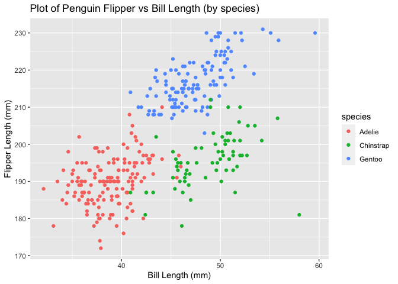

p8105_hw1_sjz2120
================
Sophie Zhang
2022-09-19

# Prep Work: Loading packages

``` r
library(tidyverse)
```

    ## ── Attaching packages ─────────────────────────────────────── tidyverse 1.3.2 ──
    ## ✔ ggplot2 3.3.6      ✔ purrr   0.3.4 
    ## ✔ tibble  3.1.8      ✔ dplyr   1.0.10
    ## ✔ tidyr   1.2.0      ✔ stringr 1.4.1 
    ## ✔ readr   2.1.2      ✔ forcats 0.5.2 
    ## ── Conflicts ────────────────────────────────────────── tidyverse_conflicts() ──
    ## ✖ dplyr::filter() masks stats::filter()
    ## ✖ dplyr::lag()    masks stats::lag()

# Problem 1

## Loading the `penguins` dataset

This problem focuses the use of inline R code, plotting, and the
behavior of ggplot for variables of different types.

Use the code below to download the a package containing the penguins
dataset, but only run it in the console (**code shown below for
reference, but using eval=FALSE in the code chunk so that the code will
only be displayed, NOT executed**)

``` r
install.packages("palmerpenguins")
```

Next, use the following code to load the `penguins` dataset:

``` r
data("penguins", package = "palmerpenguins")
```

## **Describing the penguins dataset**

``` r
str(penguins)
```

    ## tibble [344 × 8] (S3: tbl_df/tbl/data.frame)
    ##  $ species          : Factor w/ 3 levels "Adelie","Chinstrap",..: 1 1 1 1 1 1 1 1 1 1 ...
    ##  $ island           : Factor w/ 3 levels "Biscoe","Dream",..: 3 3 3 3 3 3 3 3 3 3 ...
    ##  $ bill_length_mm   : num [1:344] 39.1 39.5 40.3 NA 36.7 39.3 38.9 39.2 34.1 42 ...
    ##  $ bill_depth_mm    : num [1:344] 18.7 17.4 18 NA 19.3 20.6 17.8 19.6 18.1 20.2 ...
    ##  $ flipper_length_mm: int [1:344] 181 186 195 NA 193 190 181 195 193 190 ...
    ##  $ body_mass_g      : int [1:344] 3750 3800 3250 NA 3450 3650 3625 4675 3475 4250 ...
    ##  $ sex              : Factor w/ 2 levels "female","male": 2 1 1 NA 1 2 1 2 NA NA ...
    ##  $ year             : int [1:344] 2007 2007 2007 2007 2007 2007 2007 2007 2007 2007 ...

``` r
penguins
```

    ## # A tibble: 344 × 8
    ##    species island    bill_length_mm bill_depth_mm flipper_…¹ body_…² sex    year
    ##    <fct>   <fct>              <dbl>         <dbl>      <int>   <int> <fct> <int>
    ##  1 Adelie  Torgersen           39.1          18.7        181    3750 male   2007
    ##  2 Adelie  Torgersen           39.5          17.4        186    3800 fema…  2007
    ##  3 Adelie  Torgersen           40.3          18          195    3250 fema…  2007
    ##  4 Adelie  Torgersen           NA            NA           NA      NA <NA>   2007
    ##  5 Adelie  Torgersen           36.7          19.3        193    3450 fema…  2007
    ##  6 Adelie  Torgersen           39.3          20.6        190    3650 male   2007
    ##  7 Adelie  Torgersen           38.9          17.8        181    3625 fema…  2007
    ##  8 Adelie  Torgersen           39.2          19.6        195    4675 male   2007
    ##  9 Adelie  Torgersen           34.1          18.1        193    3475 <NA>   2007
    ## 10 Adelie  Torgersen           42            20.2        190    4250 <NA>   2007
    ## # … with 334 more rows, and abbreviated variable names ¹​flipper_length_mm,
    ## #   ²​body_mass_g

Write a short description of the `penguins` dataset (not the
`penguins_raw` dataset) using inline R code.

-   There are a total of **344 rows/entries** in the `penguins` dataset
    and a **total of 8 variables**:

    -   **3 factor variables:** `Species`, `Island`, `Sex`
    -   **5 numeric variables:** `Bill Length (in mm)`,
        `Bill Depth (in mm)`, `Flipper Length (in mm)`,
        `Body Mass (in g)`, and `Year`.

-   The dataset contains **344 rows (observations)** and **8 columns
    (variables)**.

-   The mean flipper length among penguins in this dataset is
    **200.9152047 mm**.

## Creating a scatterplot for \`penguins’ dataset

Make a scatterplot of flipper_length_mm (y) vs bill_length_mm (x), using
color points for the species variable:

``` r
##Create scatterplot of flipper length (y) vs bill length (x)
ggplot(penguins, aes(x = bill_length_mm, y = flipper_length_mm, color = species)) + geom_point() + xlab("Bill Length (mm)") + ylab("Flipper Length (mm)") + ggtitle("Plot of Penguin Flipper vs Bill Length (by species)")
```

    ## Warning: Removed 2 rows containing missing values (geom_point).

<!-- -->

## Exporting the `penguins` flipper vs bill length scatterplot

Export the scatterplot to the project directory using ggsave:

``` r
##Save scatterplot to project directory
ggsave("flipper_vs_bill_scatterplot.pdf", height = 4, width = 6)
```

    ## Warning: Removed 2 rows containing missing values (geom_point).

# Problem 2

## Creating a dataframe

Create a data frame comprised of:

-   a random sample of size 10 from a standard Normal distribution
-   a logical vector indicating whether elements of the sample are
    greater than 0
-   a character vector of length 10
-   a factor vector of length 10, with 3 different factor “levels”

``` r
problem2_df = tibble(
  var_snorm = rnorm(10, sd = 1),
  var_logic = c(var_snorm > 0),
  var_char = c("a", "b", "c", "d", "e", "f", "g", "h", "i", "j"),
  var_factor = factor(c("high", "medium", "low", "medium","high", "high", "low", "low", "medium", "high"))
)
```

## Taking the means

Try to take the mean of each variable in your dataframe. What works and
what doesn’t?

``` r
mean(pull(problem2_df, var_snorm))
```

    ## [1] -0.04278862

``` r
mean(pull(problem2_df, var_logic))
```

    ## [1] 0.5

``` r
mean(pull(problem2_df, var_char))
```

    ## Warning in mean.default(pull(problem2_df, var_char)): argument is not numeric or
    ## logical: returning NA

    ## [1] NA

``` r
mean(pull(problem2_df, var_factor))
```

    ## Warning in mean.default(pull(problem2_df, var_factor)): argument is not numeric
    ## or logical: returning NA

    ## [1] NA

We’re able to take the mean of variables `var_snorm` and `var_logic`
because they are **numeric and logical variable types** (respectively),
meaning that their values can be represented numerically. For instance,
when taking the mean for logical variable types they are treated as
TRUE=1 and FALSE=0, and we can take the mean of these 1s and 0s.

However, we’re unable to take the mean of variables `var_char` and
`var_factor` because they are character and factor variable types
(respectively). Since neither of them in their current forms are able to
be represented numerically, we can’t take the mean of these variables.

## Applying `as.numeric`

``` r
as.numeric(pull(problem2_df, var_logic))
as.numeric(pull(problem2_df, var_char))
```

    ## Warning: NAs introduced by coercion

``` r
as.numeric(pull(problem2_df, var_factor))
```

For the logical variable `var_logic`, the FALSE values are recoded as 0
while the TRUE values are recoded as 1 (thus the variable becomes
numeric).

For the character variable `var_char`, all of the values become **NA**
because there is no way to recode the character values numerically.

For the factor variable `var_factor`, the three different levels are
recoded as numbers. In this case, “high” was recoded as 1, “medium” was
recoded as 3, and “low” was recoded as 2.

**Does `as.numeric` help explain what happens when you try to take the
mean?**

This helps explain what happens when we try to take the mean of each of
these non-numeric variables. For the logical variable `var_logic`, we’re
able to take the mean because R considers FALSE=0 and TRUE=1. However,
for `var_char` and `var_factor` we are unable to take their means
because their values are not numeric; and only `var_factor` can be
converted to a numeric variable after using as.numeric.
